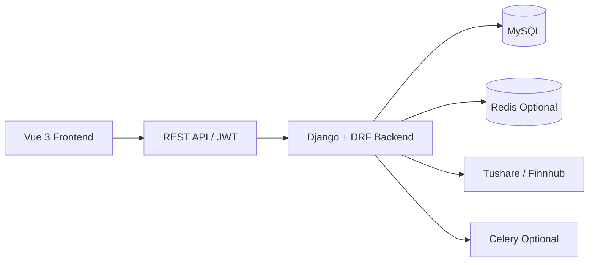

# InvestHub 股票基金投资社区系统

一个面向股票、基金投资者的前后端分离社区平台，聚焦 **行情查询、投资组合分享、社区互动、社群治理** 等核心场景，适合作为毕业设计项目展示，也具备继续工程化迭代的基础。

项目采用 `Vue 3 + TypeScript + Vite` 构建前端，采用 `Django + DRF + MySQL` 构建后端，并支持 `JWT` 认证、`Redis` 缓存、可选 `Celery` 定时任务，以及 `Tushare / Finnhub` 行情数据接入。

## 目录

- [项目简介](#项目简介)
- [核心功能](#核心功能)
- [技术栈](#技术栈)
- [系统架构](#系统架构)
- [项目结构](#项目结构)
- [快速开始](#快速开始)
- [功能模块说明](#功能模块说明)
- [项目亮点](#项目亮点)
- [文档索引](#文档索引)
- [子项目说明](#子项目说明)

## 项目简介

`InvestHub` 是一个围绕投资交流场景设计的社区系统，目标是为用户提供一个集内容发布、行情浏览、组合展示、互动讨论与社区治理于一体的平台。

系统面向的典型业务场景包括：

- 用户浏览股票/基金行情与榜单，查看个股详情、K 线与分时数据
- 用户发布投资观点、参与评论互动、点赞收藏与举报反馈
- 用户创建投资组合、展示持仓结构与策略思路
- 用户加入兴趣群组，开展更聚焦的主题交流
- 管理员对内容、用户行为与社区数据进行治理与分析

## 核心功能

- **用户与认证**
  支持注册登录、JWT 鉴权、资料管理，以及实名、专业认证、风险评估等流程扩展。

- **社区内容系统**
  支持帖子发布、详情展示、评论回复、点赞、收藏、板块分类、举报与审核。

- **行情与资产中心**
  支持资产基础信息、行情快照、K 线、分时图、市场榜单与批量报价能力。

- **投资组合与持仓**
  支持组合创建、组合详情展示、持仓记录、收益快照及组合互动。

- **社交与消息能力**
  支持关注关系、通知、私信、群组、邀请与入群审核等社交功能。

- **管理与运营治理**
  提供数据监控、审核队列、用户风险中心、运营分析等后台能力。

## 技术栈

| 层级 | 技术方案 |
|------|----------|
| 前端 | Vue 3、TypeScript、Vite、Element Plus、Pinia、Vue Router |
| 图表与可视化 | ECharts、`vue-echarts`、`lightweight-charts` |
| 后端 | Django 4.2、Django REST Framework、Simple JWT |
| 数据库 | MySQL 8.x |
| 缓存与任务 | Redis（可选）、Celery（可选） |
| 行情数据 | Tushare、Finnhub |
| 部署建议 | Nginx + Gunicorn |

## 系统架构



系统采用前后端分离架构：

- 前端负责页面渲染、交互逻辑、状态管理与图表展示
- 后端负责认证鉴权、业务编排、权限控制、数据持久化与接口输出
- MySQL 负责核心业务数据落库
- Redis 用于缓存与部分高频场景优化
- 第三方行情服务用于补充资产和市场数据

## 项目结构

```text
invest/
├── background/    # Django + DRF 后端服务
├── frontend/      # Vue 3 + TypeScript 前端项目
├── docs/          # 架构、数据库、接口、模块总结等文档
├── .cursor/       # 项目规则与 AI 协作配置
├── .gitignore
└── README.md
```

其中：

- `background/` 包含用户、内容、组合、行情、通知、私信、群组、举报等后端业务模块
- `frontend/` 包含首页、社区、行情、组合、持仓、消息、群组、管理后台等页面与前端状态管理
- `docs/` 包含系统架构、数据库设计、接口规范、核心流程、性能优化等完整项目文档

## 快速开始

### 1. 环境要求

- Node.js `18+`
- Python `3.8+`，推荐 `3.10+`
- MySQL `8.x`
- Redis（可选）

### 2. 启动后端

```bash
cd background
python -m venv .venv

# Windows
.venv\Scripts\activate

# macOS / Linux
source .venv/bin/activate

pip install -r requirements.txt
python manage.py migrate
python manage.py createsuperuser
python manage.py runserver
```

后端默认地址：

- `http://127.0.0.1:8000`
- 管理后台：`http://127.0.0.1:8000/admin/`

### 3. 启动前端

```bash
cd frontend
npm install
npm run dev
```

前端默认地址：

- `http://localhost:3000`

开发环境下前端会通过 `/api` 代理对接本地 Django 服务。

### 4. 数据与配置

- 后端使用 `background/.env` 管理数据库、密钥、Redis、第三方行情服务等配置
- 前端使用 `frontend/.env.local` 管理接口基础地址等配置
- 如需启用行情数据导入，请配置 `TUSHARE_API_TOKEN` 或相关第三方密钥

## 功能模块说明

### 前端模块

- 首页 Dashboard
- 行情列表与市场榜单
- 资产详情页与图表展示
- 社区帖子流、帖子详情、评论互动
- 投资组合与我的持仓
- 搜索、通知、私信
- 群组与社群互动
- 管理后台与数据分析页面

### 后端模块

- `accounts`：用户、登录认证、资料、关注、风控扩展
- `content`：帖子、评论、板块、互动、内容治理
- `portfolios`：投资组合、持仓、收益快照
- `market_data`：资产信息、行情快照、K 线、榜单、行情任务
- `notifications`：站内通知
- `messages`：私信会话与消息
- `groups`：群组、成员、邀请、审核
- `reports`：举报、审核队列、运营统计

## 项目亮点

- **业务完整度较高**：覆盖投资社区常见的内容、社交、组合、行情、治理全链路
- **前后端分离清晰**：模块边界明确，便于联调、扩展与论文描述
- **兼顾工程化与毕设可落地性**：技术栈主流，复杂度适中，便于实现与展示
- **文档沉淀较完整**：包含架构、数据库、接口、模块总结与性能优化说明
- **可扩展性良好**：支持 Redis、Celery、第三方行情服务等增强能力

## 文档索引

仓库内已整理较完整的项目文档，适合开发、展示与论文撰写参考：

- [系统整体架构总结文档](./docs/系统整体架构总结文档.md)
- [技术选型与设计决策文档](./docs/技术选型与设计决策文档.md)
- [数据库设计总结文档](./docs/数据库设计总结文档.md)
- [接口设计与接口规范总结文档](./docs/接口设计与接口规范总结文档.md)
- [核心业务流程总结文档](./docs/核心业务流程总结文档.md)
- [核心功能模块总结文档](./docs/核心功能模块总结文档.md)
- [前端代码总结文档](./docs/前端代码总结文档.md)
- [后端代码总结文档](./docs/后端代码总结文档.md)
- [UI-UX设计总结文档](./docs/UI-UX设计总结文档.md)
- [Tushare 集成说明](./docs/tushare_integration.md)

## 子项目说明

- 后端详细说明见 [`background/README.md`](./background/README.md)
- 前端详细说明见 [`frontend/README.md`](./frontend/README.md)

如果你希望继续完善这个仓库在 GitHub 上的展示效果，下一步通常可以补充：

- 项目截图或演示 GIF
- 部署地址与测试账号说明
- 接口文档或页面预览图

## License

本项目当前更适合作为课程设计 / 毕业设计 / 个人项目展示仓库使用。若后续准备开源发布，建议补充明确的许可证文件，例如 `MIT License`。
