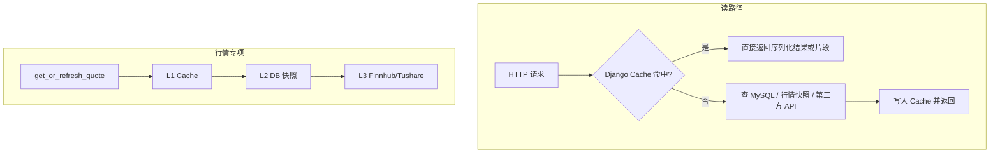

# InvestHub 缓存层性能优化工作总结

> **文档用途**：汇总后端 **Django Cache / Redis** 在「读多写少」场景下的配置、已落地能力与迭代记录，与 [`docs/数据库与后端性能优化工作总结.md`](./数据库与后端性能优化工作总结.md)（数据库与接口层优化）、[`docs/前端性能与优化工作总结.md`](./前端性能与优化工作总结.md)（前端构建与首屏）并列，便于毕业论文 **「非功能需求 / 性能优化 / 系统架构」** 章节撰写与日常工作留档。  
> **适用范围**：`background/`（Django 4.x + DRF）；缓存实现以 `invest_backend/settings.py` 与各业务 `views.py`、`market_data/tasks.py` 为准。

---

## 1. 总览：缓存在本项目中的定位

| 维度 | 说明 |
|------|------|
| **目标** | 降低热点只读接口的数据库与外部行情 API 压力；对「变更少、读取多」的数据做短 TTL 或对象级缓存；对高频浏览写做 Redis 缓冲与异步合并。 |
| **技术选型** | Django 统一缓存 API（`django.core.cache`）；生产环境可选 **django-redis** 作为后端；未启用 Redis 时退化为 **LocMemCache**（仅单进程有效）。 |
| **与数据库优化的关系** | 缓存不改变「正确索引 + 合理 ORM」的前提；二者互补：索引减少单次查询代价，缓存减少重复查询次数。详见合并版后端文档第二节。 |

---

## 2. 基础设施：Redis 与 LocMem

| 配置项 | 说明 |
|--------|------|
| `USE_REDIS` / `USE_REDIS_CONFIGURED` | 为 `true` 时使用 `django_redis.cache.RedisCache`，`LOCATION` 取自 `REDIS_URL`（默认 `redis://localhost:6379/1`），`KEY_PREFIX=invest_market`。多 **Gunicorn worker** 或多机部署时，缓存与行情 L1 可在进程间共享。 |
| 未启用 Redis | 使用 **LocMemCache**，缓存仅存于**当前进程内存**，不适合多 worker 水平扩展或缓存一致性要求高的场景。 |
| `VIEW_COUNT_USE_REDIS_BUFFER` | 与 `USE_REDIS` 联动：为 `true` 时帖子浏览量先写入 **独立 Redis 键空间**（见第 5 节），再经管理命令回写 MySQL。 |
| 运维说明 | 生产环境建议显式开启 Redis 并配置 `REDIS_URL`；浏览量缓冲需配合定时任务执行 `python manage.py flush_view_count_buffer`。详见 [`background/README.md`](../background/README.md)「缓存与 Redis」小节。 |

---

## 3. 既有能力：查询结果缓存与行情分层（专项前已存在 + 持续沿用）

以下能力在代码库中通过 **`cache.get` / `cache.set`** 或任务内回填实现，TTL 多由 `settings` 环境变量覆盖。

### 3.1 业务接口侧

| 能力 | 典型路径 / 模块 | TTL 相关配置（默认以代码为准） |
|------|-----------------|-------------------------------|
| 首页 / Dashboard 聚合 | `GET /api/dashboard/overview/` | `DASHBOARD_OVERVIEW_CACHE_TTL`（默认 60s）；缓存键区分匿名与登录用户及 `include` 参数 |
| 行情榜单 | `GET /api/market/rankings/`、`market_data.rankings.get_cached_rankings_payload` | `MARKET_RANKINGS_CACHE_TTL`（默认 120s） |
| K 线接口 | `GET /api/assets/{id}/kline/` | `KLINE_API_CACHE_TTL`（默认 60s）；键含标的、周期、limit、from/to |
| 全局搜索 | `GET /api/search/`（有 `q` 时） | `GLOBAL_SEARCH_CACHE_TTL`（默认 20s） |
| 管理台统计 | `admin_stats` | `ADMIN_STATS_CACHE_TTL`（默认 45s） |
| 板块树根（默认根节点） | `BoardListView` | `BOARD_TREE_CACHE_TTL`（默认 90s）；键 `boards:tree:root:v1`（见 `content/cache_utils.py`） |
| OAuth 状态 | 第三方登录 | 短时缓存，防 CSRF |

### 3.2 行情：`get_or_refresh_quote` 三层策略

实现于 [`background/market_data/tasks.py`](../background/market_data/tasks.py)：

| 层级 | 行为 | TTL / 说明 |
|------|------|------------|
| **L1** | Django Cache，键与资产 ID 关联 | `FINNHUB_QUOTE_CACHE_TTL`（默认 60s）等 |
| **L2** | `AssetQuoteSnapshot` 表中新鲜快照 | 时间窗口内回填 L1 |
| **L3** | Finnhub / Tushare 等拉取 | 写入快照后再写 L1；批量任务写入快照后亦回填缓存 |

A 股等场景另有 `TUSHARE_QUOTE_CACHE_TTL` 等配置，与数据源特性对齐。

### 3.3 与《数据库与后端性能优化工作总结》的交叉引用

- 全局搜索在文档中已强调 **较短 TTL** 与 **FULLTEXT / 前缀匹配** 配合，见该文档 **2.3、3.3** 节。
- 接口耗时与 `EXPLAIN` 自测仍推荐 [`background/PERF_NOTES.md`](../background/PERF_NOTES.md)，缓存不能替代慢 SQL 根治。

---

## 4. 本轮专项：缓存层增强（实现摘要）

下列为在「缓存层扫描与优化」迭代中**新增或加固**的内容，便于论文中写「迭代二 / 缓存子系统」。

### 4.1 批量行情 `POST /api/assets/quotes/`

- **问题**：列表页、组合页高频按相同 `assetIds` 批量读快照，重复计算与序列化可压缩。
- **做法**：对请求体中的 `assetIds` **按请求顺序**拼成稳定键，响应体短 TTL 缓存（`BULK_QUOTES_CACHE_TTL`，默认 30s）。
- **代码**：[`background/market_data/views.py`](../background/market_data/views.py) `asset_quotes_bulk`。

### 4.2 标的详情静态字段对象缓存

- **问题**：`GET /api/assets/{id}/` 每次查库读 `Asset`；`quote` 已由 `get_or_refresh_quote` 缓存。
- **做法**：对 **`AssetSerializer` 静态字典**做缓存（`ASSET_DETAIL_STATIC_CACHE_TTL`，默认 600s），**深拷贝后再挂载 `quote`**，避免把行情写入静态缓存。
- **失效**：`Asset` 模型 `post_save` / `post_delete` 信号中删除对应键（[`background/content/signals.py`](../background/content/signals.py)、[`background/content/asset_cache.py`](../background/content/asset_cache.py)）。

### 4.3 板块树缓存失效

- **问题**：管理端或 Django Admin 修改板块后，前台仍可能短期命中旧树根。
- **做法**：统一 `invalidate_board_tree_cache()`（[`background/content/cache_utils.py`](../background/content/cache_utils.py)）；在管理员 API 创建/更新/删除板块及 **`BoardAdmin.save_model` / `delete_model`** 后调用。

### 4.4 浏览量 Redis 缓冲 + 定时回写

- **问题**：帖子详情每次 `GET` 若直接 `UPDATE view_count`，高并发下写放大。
- **做法**（可选，需 `USE_REDIS=true` 且 `VIEW_COUNT_USE_REDIS_BUFFER=true`）：
  - 使用独立 Redis 键 `invest:vcbuf:{content_id}` 与待合并集合 `invest:vcbuf:pending` 做 **INCR**；
  - 管理命令 **`flush_view_count_buffer`** 将增量 **`F()` 合并**回 `Content.view_count` 并清理键；
  - 详情接口返回 **`viewCount`** = 数据库值 + 未回写增量（[`background/content/view_count_buffer.py`](../background/content/view_count_buffer.py)、[`ContentDetailSerializer`](../background/content/serializers.py)）。
- **未启用缓冲时**：行为与原先一致，每次浏览直接更新数据库。

### 4.5 默认 TTL 微调（与论文「参数可配置」表述）

| 变量 | 调整意图（默认可通过环境变量覆盖） |
|------|-----------------------------------|
| `DASHBOARD_OVERVIEW_CACHE_TTL` | 默认由 30s 调至 **60s**，贴近「首页 30s～2min」区间下限 |
| `MARKET_RANKINGS_CACHE_TTL` | 默认由 20s 调至 **120s**，贴近「榜单 1～5min」区间 |

具体数值以部署环境 `settings` 为准。

---

## 5. 仍为「二期 / 待增强」的方向（论文可写局限与展望）

| 方向 | 说明 |
|------|------|
| 帖子列表 / 社区流 HTTP 级缓存 | 默认 sort + 首屏可考虑短缓存，需与 **用户相关**（点赞态）键策略及发帖/审核 **失效** 一并设计 |
| `GET /api/assets/` + `withQuote=1` | 整页或按条件缓存可进一步降低快照子查询频率 |
| 分时 `intraday` | 可与 K 线类似增加短 TTL（视交易时段与数据更新频率） |
| 用户主页 `overview` | 仍以 SQL 与索引优化为主，可评估只读摘要缓存 |
| Dashboard / 搜索键失效 | 内容发布、审核通过等事件可显式 `delete` 或按前缀清理，保证强一致体验 |

---

## 6. 论文撰写可参考的表述角度

1. **架构**：采用 Django 缓存抽象，生产环境对接 Redis，实现热点接口 **查询结果缓存** 与行情 **多级缓存**，兼顾可移植与运维可配置性。  
2. **读多写少**：标的静态信息、板块树、榜单、首页聚合等采用 **TTL + 显式失效** 组合。  
3. **写密集计数**：浏览量采用 **内存增量 + 批量回写** 的 **最终一致性** 思路，减轻数据库瞬时写压力（可选开启）。  
4. **验证**：结合 `DJANGO_API_TIMING_LOG`、`PERF_NOTES` 中的路径与 `manage.py flush_view_count_buffer` 的运维记录，支撑非功能需求与对比实验描述。

---

## 7. 关键代码与配置索引

| 说明 | 路径 |
|------|------|
| 缓存后端、TTL、Redis、浏览量缓冲开关 | `background/invest_backend/settings.py` |
| 板块树键与失效 | `background/content/cache_utils.py` |
| 标的静态缓存 | `background/content/asset_cache.py` |
| 浏览量缓冲与 flush 逻辑 | `background/content/view_count_buffer.py` |
| 管理命令：回写浏览量 | `background/content/management/commands/flush_view_count_buffer.py` |
| Asset 缓存失效信号 | `background/content/signals.py`、`content/apps.py` |
| 批量行情缓存 | `background/market_data/views.py` |
| 行情 L1/L2/L3 | `background/market_data/tasks.py` |
| 榜单缓存封装 | `background/market_data/rankings.py` |
| 运维与环境变量说明 | `background/README.md` |
| API 自测与 SQL 侧备忘 | `background/PERF_NOTES.md` |
| 数据库与接口层合并总结（互补） | `docs/数据库与后端性能优化工作总结.md` |

---

## 8. 修订记录

| 日期 | 修订说明 |
|------|----------|
| 2026-04-06 | 首版：合并「既有 Django/Redis 缓存与行情分层」与「缓存层专项」浏览量缓冲、标的静态缓存、批量行情缓存、板块失效、TTL 与 README 运维说明，服务论文与工作记录。 |

---

*生产环境请以实际 `settings` 与部署脚本为准；开启浏览量缓冲后请务必配置定时 `flush_view_count_buffer`，避免 Redis 与长期数据库统计偏差过大。*
