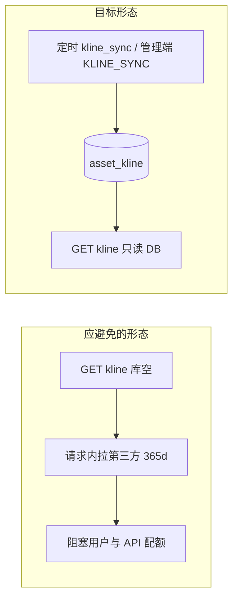

# InvestHub 行情 / K 线 / 收益计算性能优化工作总结

> **文档用途**：汇总本系统在 **行情快照、K 线数据、组合加权收益、持仓净值曲线** 等计算密集型场景上的**设计原则、已落地实现、配置项与运维入口**，便于毕业论文 **「系统实现 / 性能优化 / 数据同步 / 非功能需求」** 章节撰写，以及日常迭代与答辩材料对照。  
> **适用范围**：`background/market_data`、`background/portfolios`、定时任务与可选 Celery；与下列文档**互补而非重复**：

| 文档 | 关系 |
|------|------|
| [`docs/缓存层性能优化工作总结.md`](./缓存层性能优化工作总结.md) | 行情 **L1/L2/L3** 分层、批量 `POST /api/assets/quotes/`、K 线接口 TTL 等**缓存视角**总述 |
| [`docs/数据库与后端性能优化工作总结.md`](./数据库与后端性能优化工作总结.md) | `asset_kline`、`asset_quote_snapshot`、`holding_daily_snapshot` 等表的**索引与冷热数据**在合并版中的位置 |
| [`background/PERF_NOTES.md`](../background/PERF_NOTES.md) | API 耗时日志、`EXPLAIN`、热点表运维备忘 |
| [`docs/前端性能与优化工作总结.md`](./前端性能与优化工作总结.md) | 前端构建与首屏；K 线组件默认 `limit` 等与前端协同处本文会点到 |

---

## 1. 问题背景与优化原则

投资社区系统中，**A 股与海外标的、日 K 与分钟线、持仓日快照、组合收益率** 叠加后，若采用「实时现算、逐条写入、每次页面访问全量重算、按用户串行更新」等模式，瓶颈往往落在 **后台任务、数据库写入与接口计算**，而非单纯前端卡顿。

本项目在毕设可维护范围内，遵循四条原则：

| 原则 | 含义 | 典型落地 |
|------|------|----------|
| **预计算优先** | 展示用指标尽量来自**定时任务或快照表**，读路径只做轻量聚合 | 持仓 `HoldingDailySnapshot`、组合收益指标缓存（见下文） |
| **批量写入** | Django 侧优先 `bulk_create`、批量 SQL、分批事务 | K 线 `_write_klines`、`quote_refresh` A 股批量、海外攒批入库 |
| **异步与调度** | 重活放 **Celery Beat / crontab / 管理命令**，不放在普通用户请求的同步链路 | `kline_sync`、`fill_holding_snapshots`、`cleanup_old_snapshots` |
| **接口收窄** | 只返回**必要时间区间与条数**，避免一次拉满全历史 | K 线 `limit` 默认与上限、收益历史 `days` / `from`–`to` |

---

## 2. 数据与任务基线（论文可引用）

### 2.1 核心表（节选）

| 表 / 模型 | 作用 |
|-----------|------|
| `asset_quote_snapshot` | 最新行情快照，配合 L1/L2 缓存与定期清理 |
| `asset_kline` | 多周期 K 线落库，供图表与持仓估值 |
| `user_holding` | 持仓数量与成本价 |
| `holding_daily_snapshot` | 按日收盘价估值，**唯一约束 (holding, date)**，支持 `INSERT IGNORE ... SELECT` 批量补缺 |

### 2.2 主要任务函数（`market_data.tasks`）

| 任务 | 作用 |
|------|------|
| `kline_sync` | 按市场路由 Tushare / Finnhub，日线按交易日批量 `bulk_create` 等 |
| `quote_refresh` / `quote_refresh_popular` | 刷新快照；A 股可走批量 API；海外 Finnhub 仍**逐请求节流**，DB 侧可**攒批写入** |
| `cleanup_old_snapshots` | 控制 `asset_quote_snapshot` 保留窗口 |
| `get_or_refresh_quote` | 单资产读路径：**L1 Cache → L2 新鲜快照 → L3 第三方**（详见缓存层文档） |

### 2.3 持仓快照管理命令

- **`python manage.py fill_holding_snapshots`**：从 `AssetKline` 日 K 与 `user_holding` **一条 SQL** `INSERT IGNORE ... SELECT` 补缺（详见命令文件头注释），避免 Python 双层循环逐条插入。

---

## 3. 本轮专项：已落地实现摘要

以下与当前代码库一致，用于工作记录与论文「实现细节」小节。

### 3.1 K 线接口 `GET /api/assets/{id}/kline/`

| 项目 | 说明 |
|------|------|
| **读路径** | **仅从数据库**读取已同步的 `AssetKline`，不在用户请求内调用 Tushare/Finnhub 做**大批量回补** |
| **冷启动** | 库无数据时返回 **空 `items`**，并在 `data.hint` 中提示通过定时 **`kline_sync`** 或管理端 **`POST /api/market/jobs/trigger/`** 且 `job_type=KLINE_SYNC` 回补 |
| **默认条数** | `KLINE_DEFAULT_LIMIT`（默认 **90**），上限 `KLINE_MAX_LIMIT`（默认 **500**），可通过环境变量调整 |
| **缓存** | 仍使用 `KLINE_API_CACHE_TTL`；缓存键含标的、周期、`limit`、`from`/`to` |
| **前端协同** | `KlineChart.vue` 默认 `limit: 90`；类型 `AssetKlineData` 含可选 **`hint`** |

**论文表述建议**：将「冷数据回补」与「用户读请求」解耦，避免将第三方 API 与批量写压力压入 HTTP 同步链路，符合 Web 层**无状态、快速返回**的实践。

### 3.2 `quote_refresh` 海外（Finnhub）支路

| 项目 | 说明 |
|------|------|
| **API 侧** | 仍为**逐资产请求** + `delay` 节流，遵守 Finnhub 速率限制 |
| **DB 侧** | 成功拉取后**攒批**再 `bulk_create`，批量大小 `QUOTE_REFRESH_FH_DB_BATCH_SIZE`（默认 **200**） |

**论文表述建议**：在**不改变第三方调用频率**的前提下，将「逐条 INSERT」改为「分批 INSERT」，降低数据库往返与日志开销。

### 3.3 组合加权收益指标 `_build_portfolio_metrics`

| 项目 | 说明 |
|------|------|
| **计算逻辑** | 仍基于 `AssetKline` 日 K 在约 400 日窗口内做加权日/7 日/YTD 收益（业务含义不变） |
| **缓存** | 新增 **`get_portfolio_metrics`**：以「当前请求涉及的**组合 id 排序元组**」为键，短 TTL **`PORTFOLIO_METRICS_CACHE_TTL`**（默认 **120s**），减轻列表页重复扫日 K |
| **接入点** | 组合列表/详情/Top、用户主页 overview 等原调用处改为 **`get_portfolio_metrics`** |

**后续可扩展**（论文「展望」）：日终落库 `portfolio_performance_daily` 或 `Portfolio.metrics_json`，读接口 O(1) 字段（本轮未建表）。

### 3.4 持仓收益历史 `GET /api/holdings/returns-history/`

| 项目 | 说明 |
|------|------|
| **聚合方式** | 使用 ORM **`Sum(quantity × close_price)` + `GROUP BY date`**，替代原先「拉全表快照再在 Python 按日双层循环」 |
| **参数** | **`days`**：默认 `HOLDING_RETURNS_HISTORY_DEFAULT_DAYS`（**365**），上限 `HOLDING_RETURNS_HISTORY_MAX_DAYS`（**3650**）；或同时传 **`from` / `to`**（`YYYY-MM-DD`），区间过长时**截断为最近 max 天** |
| **响应** | 增加 **`dateFrom`、`dateTo`** 标明实际窗口；前端 `getHoldingReturnsHistory` 支持可选 query 参数 |

### 3.5 定时调度：Celery Beat 与无 Celery 的 crontab

**Celery（可选依赖）**

- 配置：`CELERY_BROKER_URL`、`CELERY_RESULT_BACKEND`、`CELERY_BEAT_SCHEDULE`（在已安装 **celery** 时由 `celery.schedules.crontab` 等定义）。
- 任务模块：[`background/market_data/celery_tasks.py`](../background/market_data/celery_tasks.py)（`@shared_task` 包装 `quote_refresh_popular`、`kline_sync`、`fill_holding_snapshots`、`cleanup_old_snapshots`）。
- 注册：[`background/invest_backend/celery.py`](../background/invest_backend/celery.py) 在 `autodiscover_tasks` 后 **import `market_data.celery_tasks`**。
- 典型 Beat 项（以 `settings` 为准）：热门行情**高频**、日 K 同步、持仓快照补缺、快照清理等**钟点任务**。

**无 Celery 时**

- 管理命令：**`python manage.py run_daily_market_jobs`**（[`background/market_data/management/commands/run_daily_market_jobs.py`](../background/market_data/management/commands/run_daily_market_jobs.py)）：串联 `kline_sync` → `fill_holding_snapshots` → `cleanup_old_snapshots`，适合 **cron 日终**执行。
- 交易时段热门行情可继续用既有 **`sync_market_data --task quote`** 或 API 触发（以实际运维为准）。

---

## 4. 环境变量与配置项索引

下列均在 [`background/invest_backend/settings.py`](../background/invest_backend/settings.py) 中读取，可通过 `.env` 覆盖（具体以部署为准）。

| 变量 | 含义（默认） |
|------|----------------|
| `KLINE_API_CACHE_TTL` | K 线 HTTP 响应缓存秒数（60） |
| `KLINE_DEFAULT_LIMIT` | K 线默认返回条数（90） |
| `KLINE_MAX_LIMIT` | K 线单次最大条数（500） |
| `QUOTE_REFRESH_FH_DB_BATCH_SIZE` | 海外行情刷新攒批大小（200） |
| `PORTFOLIO_METRICS_CACHE_TTL` | 组合加权指标缓存秒数（120） |
| `HOLDING_RETURNS_HISTORY_DEFAULT_DAYS` | 收益历史默认天数（365） |
| `HOLDING_RETURNS_HISTORY_MAX_DAYS` | 收益历史最大跨度（3650） |
| `CELERY_BROKER_URL` / `CELERY_RESULT_BACKEND` | Celery 消息与结果后端 |
| `FINNHUB_QUOTE_CACHE_TTL` 等 | 单资产行情 L1/L2 行为（见缓存层文档） |

---

## 5. 观测与论文实验建议

1. **接口耗时**：设置 **`DJANGO_API_TIMING_LOG=true`**，关注 `asset_kline`、`GET /api/portfolios/`、`holdings/returns-history/` 等打点（见 [`background/PERF_NOTES.md`](../background/PERF_NOTES.md)）。
2. **优化前后对比**：同一环境、相近数据量下对比 **P95 延迟**与 **SQL 次数**（可用 Django Debug Toolbar 开发环境辅助）。
3. **论文结构建议**：「数据层：快照与 K 线表 + 索引」「任务层：同步与清理」「接口层：只读库、限窗、缓存」「调度层：Beat/cron 与请求解耦」。

---

## 6. 与既有总结文档的交叉引用

| 主题 | 详见 |
|------|------|
| 行情多级缓存 L1/L2/L3、批量 quotes、K 线 TTL | [`docs/缓存层性能优化工作总结.md`](./缓存层性能优化工作总结.md) 第 3 节 |
| 行情表索引与冷热数据、FULLTEXT 等 | [`docs/数据库与后端性能优化工作总结.md`](./数据库与后端性能优化工作总结.md) 第 2 节 |
| 帖子/列表等接口优化（非行情专项） | [`docs/后端性能与优化工作总结.md`](./后端性能与优化工作总结.md) |

---

## 7. 修订记录

| 日期 | 修订说明 |
|------|----------|
| 2026-04-06 | 首版：合并「行情/K 线/收益计算性能优化」专项落地说明与既有文档中相关索引，服务论文与工作记录。 |

---

*生产环境请以实际 `settings`、密钥与 crontab 为准；未配置 Tushare/Finnhub 时，部分同步任务会跳过或降级，属预期行为，部署文档见 [`background/README.md`](../background/README.md)。*
