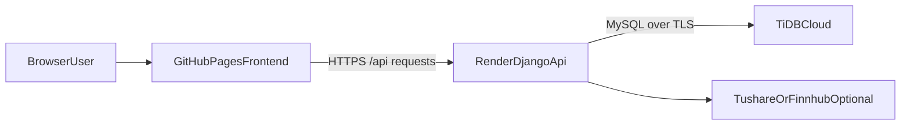

# 项目部署上线总结文档

## 1. 文档目标

本文档用于总结 `InvestHub` 股票基金投资社区系统的实际部署方案、线上地址、关键配置与上线过程中的问题处理方式，便于：

- 项目交付与后续维护
- 毕业设计论文中的“系统部署与运行环境”章节撰写
- 答辩展示时快速说明系统已完成公网部署

## 2. 线上部署结果

当前系统已完成前后端分离部署，公网访问地址如下：

| 模块 | 平台 | 线上地址 | 说明 |
|------|------|----------|------|
| 前端 | GitHub Pages | `https://oekkoo.github.io/invest-community/` | 部署 Vue 3 + Vite 静态站点 |
| 后端 | Render Web Service | `https://invest-community-api.onrender.com` | 部署 Django + DRF API 服务 |
| 数据库 | TiDB Cloud | 云端 MySQL 兼容数据库 | 为 Render 后端提供持久化数据存储 |

## 3. 部署架构

系统采用典型的前后端分离部署方式：

- 前端使用 GitHub Pages 托管静态资源，适合 Vue 3 + Vite 打包结果的快速上线
- 后端使用 Render 托管 Python Web Service，负责业务接口、权限控制、JWT 认证与数据库访问
- 数据库使用 TiDB Cloud 提供 MySQL 兼容能力，并通过 TLS 与后端通信

## 4. 前端部署说明（GitHub Pages）

### 4.1 部署平台选择

前端为纯静态单页应用，采用 GitHub Pages 免费托管，优点如下：

- 与 GitHub 仓库联动方便，适合课程项目展示
- 支持自动化工作流构建与发布
- 可直接生成公网演示地址，便于论文和答辩展示

### 4.2 实际部署要点

前端项目位于 `frontend/`，实际部署时做了以下配置：

- 在 `frontend/vite.config.ts` 中增加 `base: '/invest-community/'`
- 在 `.github/workflows/deploy.yml` 中配置 GitHub Actions 自动构建与发布
- 在构建产物中补充 `404.html`，兼容 Vue Router history 模式下的刷新访问
- 生产环境接口地址通过 `frontend/.env.production` 提供：
  `VITE_API_BASE_URL=https://invest-community-api.onrender.com/api`

### 4.3 自动部署流程

当前仓库通过 GitHub Actions 实现自动部署：

1. 开发者将代码推送到 `main`
2. GitHub Actions 进入 `frontend/` 安装依赖并执行 `npm run build`
3. 将 `frontend/dist` 发布到 `gh-pages` 分支
4. GitHub Pages 对外提供访问地址

### 4.4 前端验收标准

- 能正常打开首页与登录页
- 静态资源无白屏、无路径错误
- 登录、帖子列表、行情、组合等页面能正常请求后端接口
- 刷新子路由页面时不出现 GitHub Pages 404

## 5. 后端部署说明（Render）

### 5.1 部署平台选择

后端为 Django + DRF 项目，采用 Render 的 Python Web Service 部署，主要原因如下：

- 支持 Python 原生运行时，适合 Django + Gunicorn
- 支持与 GitHub 仓库自动同步部署
- 免费方案可满足毕业设计演示与基础访问需求

### 5.2 实际部署配置

后端项目位于 `background/`，Render 实际配置如下：

| 配置项 | 值 |
|------|------|
| Root Directory | `background` |
| Runtime | Python `3.11` |
| Build Command | `pip install -r requirements/prod.txt && python manage.py collectstatic --noinput && python manage.py migrate` |
| Start Command | `gunicorn invest_backend.wsgi:application --bind 0.0.0.0:$PORT` |

### 5.3 后端环境变量要点

Render 侧配置了以下关键环境变量：

- `DJANGO_SETTINGS_MODULE=invest_backend.settings.prod`
- `DJANGO_SECRET_KEY=<生产密钥>`
- `DJANGO_ALLOWED_HOSTS=invest-community-api.onrender.com`
- `CORS_ALLOWED_ORIGINS=https://oekkoo.github.io`
- `DJANGO_CSRF_TRUSTED_ORIGINS=https://oekkoo.github.io`
- `DB_NAME`
- `DB_USER`
- `DB_PASSWORD`
- `DB_HOST`
- `DB_PORT`
- `DB_SSL=true`
- `DB_SSL_MODE=REQUIRED`

说明：

- GitHub Pages 的浏览器来源应填写为 `https://oekkoo.github.io`，不带具体路径
- 生产环境下后端必须显式指定 `invest_backend.settings.prod`
- 后端公网根路径 `/` 返回 `Not Found` 属于正常现象，因为系统未定义首页路由；主要验证地址应为 `/healthz` 与 `/api/...`

### 5.4 后端上线验收

部署完成后，可通过以下地址进行验证：

- 健康检查：`https://invest-community-api.onrender.com/healthz`
- 公开接口示例：`https://invest-community-api.onrender.com/api/posts/`
- 登录接口路径：`https://invest-community-api.onrender.com/api/auth/login/password/`

## 6. 数据库部署说明（TiDB Cloud）

### 6.1 平台选择

数据库采用 TiDB Cloud 提供的 MySQL 兼容实例，原因如下：

- 提供云端托管数据库，减少本地部署和运维成本
- 与 Django 的 MySQL 协议兼容，便于项目迁移
- 可直接用于 Render 公网后端访问

### 6.2 实际接入方式

后端通过 `DB_*` 环境变量连接 TiDB Cloud：

- `DB_NAME`
- `DB_USER`
- `DB_PASSWORD`
- `DB_HOST`
- `DB_PORT`

同时开启 TLS：

- `DB_SSL=true`
- `DB_SSL_MODE=REQUIRED`

### 6.3 数据库接入注意事项

- TiDB Cloud 要求使用加密连接，普通未加密 MySQL 连接会被拒绝
- Render 与 TiDB Cloud 联调时，必须确保后端驱动明确启用 TLS
- 生产数据库账号、密码、主机等敏感信息不应写入仓库，应仅保存在平台环境变量中

## 7. 上线过程中解决的关键问题

本项目实际部署时解决了以下关键问题：

### 7.1 GitHub Pages 子路径问题

由于前端部署在 `/invest-community/` 子路径下，必须在 Vite 中配置：

- `base: '/invest-community/'`

否则会出现白屏、样式丢失、资源路径错误等问题。

### 7.2 GitHub Pages 单页应用刷新 404

GitHub Pages 不会像 Nginx 一样自动做 SPA 路由回退，因此需要额外生成：

- `404.html`

用于兼容子路由刷新访问。

### 7.3 Render Python 版本兼容问题

Render 默认新建服务可能使用较新的 Python 版本，而当前依赖栈基于 Django 4.2 和 Pillow 10 进行适配，因此项目中补充了版本固定方案，确保后端运行在 Python 3.11 环境中。

### 7.4 TiDB Cloud TLS 连接问题

TiDB Cloud 禁止不安全连接，因此后端数据库配置中增加了适用于 PyMySQL 的 TLS 启用逻辑，保证 Render 到 TiDB Cloud 的 MySQL 连接为加密连接。

### 7.5 前后端接口前缀不一致问题

后端接口统一挂载在 `/api` 下，因此前端生产环境接口基址必须配置为：

- `https://invest-community-api.onrender.com/api`

若遗漏 `/api`，会导致登录、帖子列表等接口请求错误。

### 7.6 GitHub Pages 域名大小写与 CORS 问题

浏览器实际来源是：

- `https://oekkoo.github.io`

因此 Render 后端 CORS 与 CSRF 信任源也需要与该域名保持一致，避免预检请求失败。

## 8. 当前部署方案的优缺点

### 8.1 优点

- 部署成本低，适合本科毕业设计项目落地
- 前后端分离清晰，便于论文撰写和答辩说明
- 可直接通过公网地址演示完整业务流程
- 自动化部署流程较完整，维护成本较低

### 8.2 局限

- Render 免费实例在长时间无访问时会休眠，首次访问可能有冷启动延迟
- GitHub Pages 仅适合静态站点，不适合托管 SSR 或动态后端
- TiDB Cloud 为云数据库，需依赖公网网络与 TLS 配置稳定性

## 9. 论文撰写建议

在毕业论文中，可将本次部署内容归纳为“系统部署与运行环境设计”，建议从以下角度展开：

- 前后端分离部署方案设计
- GitHub Pages 静态资源托管实现
- Render 后端服务部署与 Gunicorn 启动
- TiDB Cloud 云数据库接入与 TLS 安全连接
- 跨域访问控制与前后端联调问题处理

这些内容既体现了系统的工程落地能力，也有利于说明项目已具备完整的上线运行条件。

## 10. 结论

截至当前版本，`InvestHub` 已完成完整的公网部署链路：

- 前端在 GitHub Pages 上可正常访问
- 后端在 Render 上可正常提供 API 服务
- 数据库已接入 TiDB Cloud 并稳定运行

该部署方案满足毕业设计“可运行、可演示、可答辩、可写论文”的基本要求，同时保留了后续继续优化和工程化扩展的空间。
